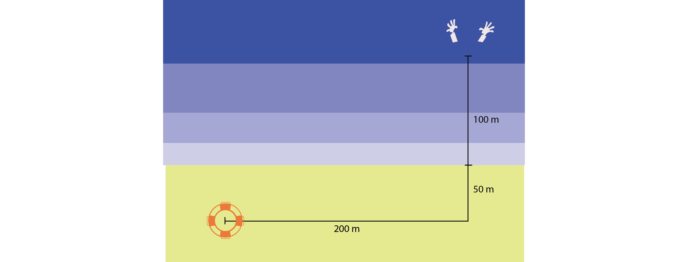

# The lifeguard optimization problem

A lifeguard can run on sand at 13 km/h. He can swim at 5.4km/h. On a sunny day, he sees a person drowning in the distance.

1.  What is the path the lifeguard should take to reach and save the drowning person if he wants to: a) minimize time? b) minimize travelled distance? c) maximize average speed? d) go straight to the drowning person? e) swim as few as possible?
2.  How would the answers change if he can swim at 7.2km/h?

## Exercise

Starting from [lifeguard.gms](https://github.com/polimi-energy-modelling/ex06-lifeguard/blob/master/lifeguard.gms), write a GAMS program to answer the questions above. Then, complete the following table.

| Strategy         | Time [s] (5.4km/h) | Time [s] (7.2km/h) |
|---------------- |------------------ |------------------ |
| a) min time      |                    |                    |
| b) min dist      |                    |                    |
| c) max avg speed |                    |                    |
| d) linear        |                    |                    |
| e) min swim      |                    |                    |

As a quick reminder of GAMS syntax, you can check [reference-card.gms](https://github.com/jackjackk/gams-ref-card/blob/master/README.org).
